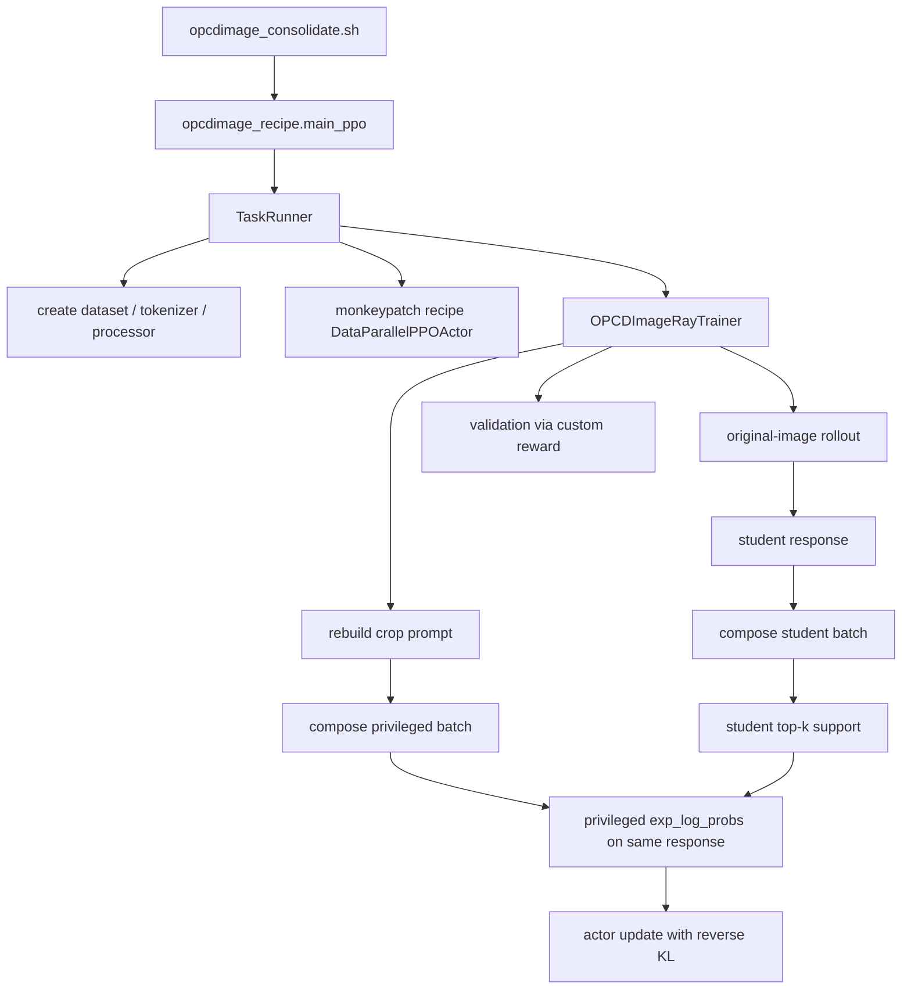
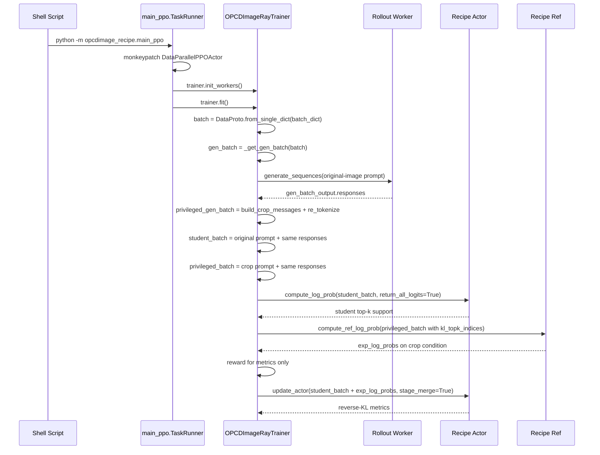

# OPCDImage 代码调用全流程

这份文档专门解释当前 `opcdimage` 重构后的**代码执行链路**，目标不是讲实验动机，而是回答下面三个问题：

1. 命令从哪里进入。
2. 一条 batch 在训练时是如何流过 dataset、trainer、worker、actor 的。
3. 最后反传的 loss 到底是什么，为什么它是 reverse KL，而不是 PPO reward 或 upstream distillation。

本文默认对应当前 recipe-local 实现：

- 训练入口：`python -m opcdimage_recipe.main_ppo`
- recipe 入口实现：`opcdimage_recipe/main_ppo.py`
- recipe trainer：`opcdimage_recipe/ray_trainer.py`
- recipe actor：`opcdimage_recipe/dp_actor.py`
- 自定义 dataset：`opcdimage_recipe/paired_vqa_dataset.py`
- 自定义 reward：`opcdimage_recipe/reward_fn.py`

---

## 1. 一句话先说清楚这套实验在做什么

当前 `opcdimage` 的训练语义是：

- student 只看 `original_images`，在原图条件下 rollout 出一条 response。
- privileged 分支不重新采样，而是复用这条 student response。
- privileged 分支只把 prompt 里的图像替换成 `crop_images`，然后在 crop 条件下重新计算这条 response 的 token log-prob。
- actor 最终更新的是：

```text
KL(student(original_image) || privileged(crop_image))
```

也就是 reverse KL。

reward function 只负责：

- 训练时记录 `curr_acc`
- 验证时计算准确率

它不是 actor 主梯度来源。

---

## 2. 总体结构图



---

## 3. 从 `opcdimage_consolidate.sh` 开始

训练入口是：

```bash
python3 -m opcdimage_recipe.main_ppo --config-name=ppo_trainer.yaml ...
```

这个脚本的职责有三类。

### 3.1 准备运行环境

脚本先设置一些运行时环境变量，例如：

- `NCCL_TIMEOUT`
- `TOKENIZERS_PARALLELISM`
- `WANDB_INIT_TIMEOUT`
- `HYDRA_FULL_ERROR`

然后它会：

- 自动下载/校验数据集
- 设置模型路径
- 组织 Hydra 参数

### 3.2 指定本实验必须使用的组件

脚本显式指定：

- dataset 类：`opcdimage_recipe/paired_vqa_dataset.py`
- reward 函数：`opcdimage_recipe/reward_fn.py`
- 训练入口：`opcdimage_recipe.main_ppo`

这三项决定了当前实验不走通用 `verl` 默认路径，而是走 recipe-local 路径。

### 3.3 传入这套实验的关键语义开关

脚本传入的关键配置是：

```text
data.image_key=original_images
reward.custom_reward_function.path=.../opcdimage_recipe/reward_fn.py
++opcdimage.privileged_mode=crop
++opcdimage.on_policy_merge=True
trainer.use_legacy_worker_impl=enable
```

它们分别表示：

| 配置 | 含义 |
| --- | --- |
| `data.image_key=original_images` | student rollout 一定看原图 |
| `++opcdimage.privileged_mode=crop` | privileged prompt 用 crop 图重建 |
| `++opcdimage.on_policy_merge=True` | privileged 分支复用 student 同一条 response |
| `reward.custom_reward_function.*` | 训练/验证使用本地多选题 reward |
| `trainer.use_legacy_worker_impl=enable` | 必须走 legacy FSDP worker，才能接上 recipe actor monkeypatch |

其中最后一项非常关键。

当前 recipe actor 的接入方式不是改 `verl` core，而是：

- 保持 upstream `verl` worker 实现不变
- 在 recipe 的 `TaskRunner` 里，把 `verl.workers.actor.DataParallelPPOActor` 替换成 recipe 自己的版本

只有 legacy FSDP worker 会走这条初始化路径，所以这里必须 `enable`。

---

## 4. `opcdimage_recipe.main_ppo` 做了什么

`opcdimage_recipe/main_ppo.py` 基本分三层：

1. `main(config)`
2. `run_ppo(config)`
3. `TaskRunner.run(config)`

### 4.1 `main(config)`

`main()` 只做两件事：

- 调 `auto_set_device(config)`
- 调 `run_ppo(config)`

它本身不包含实验逻辑。

### 4.2 `run_ppo(config)`

`run_ppo()` 做 Ray 初始化，然后远程启动 `TaskRunner`。

这一层的作用是：

- 让训练仍然保持 upstream 的分布式启动方式
- 但把“真正的 trainer 类型”和“真正的 actor 类型”延后到 recipe 内部决定

### 4.3 `TaskRunner.run(config)`

这是第一层真正进入实验逻辑的地方。

它顺序上做了下面几件事：

1. 创建 actor / critic / ref worker 的 role 映射。
2. 创建 tokenizer 和 processor。
3. 创建 train/val dataset。
4. 创建 resource pool manager。
5. 调 `_install_recipe_actor()`。
6. 实例化 `OPCDImageRayTrainer`。
7. `trainer.init_workers()`
8. `trainer.fit()`

这里最重要的是第 5 步。

### 4.4 `_install_recipe_actor()` 为什么重要

`_install_recipe_actor()` 会执行 monkeypatch：

```python
import verl.workers.actor as actor_pkg
import verl.workers.actor.dp_actor as actor_module

actor_pkg.DataParallelPPOActor = DataParallelPPOActor
actor_module.DataParallelPPOActor = DataParallelPPOActor
```

这样当 upstream 的 `verl/workers/fsdp_workers.py` 后面执行：

```python
from verl.workers.actor import DataParallelPPOActor
```

并创建：

- actor
- ref policy

时，实际拿到的已经是 `opcdimage_recipe/dp_actor.py` 中的实现。

这就是本次重构的核心策略：

- 不改 `verl` core
- 只在 recipe 层替换实验特有 actor

---

## 5. dataset 阶段到底产出什么

当前 dataset 是 `OPCDImagePairedVQADataset`。

### 5.1 它默认把哪个字段当 prompt 和 image

dataset 类里固定了：

```python
prompt_key = "problem"
image_key = "original_images"
```

这意味着：

- 训练样本默认 prompt 文本来自 `problem`
- 插入到 prompt 里的图像默认来自 `original_images`

所以 rollout 阶段天然就是“原图 prompt”。

### 5.2 `__getitem__()` 返回哪些关键字段

每条样本至少会准备这些字段：

| 字段 | 用途 |
| --- | --- |
| `raw_prompt` | 原始 chat message 结构 |
| `original_images` | student rollout 用图 |
| `crop_images` | privileged prompt 重建时要替换进去的图 |
| `reward_model.ground_truth` | reward/validation 需要的答案 |
| `extra_info.crop_image` | crop 图路径冗余校验 |

其中 `__getitem__()` 会强制检查：

- `crop_images` 必须存在
- `crop_images` 长度必须是 1
- `extra_info.crop_image` 必须存在

这保证 privileged crop 分支在训练时不会缺字段。

### 5.3 `re_tokenize()` 的作用

`re_tokenize(messages)` 是这套实验非常关键的一个接口。

它接受一份 chat message 列表，然后重新生成：

- `input_ids`
- `attention_mask`
- `position_ids`
- `multi_modal_inputs`
- `raw_prompt_ids`

为什么这个接口关键？

因为 privileged 分支不是重新定义一个新 dataset，而是：

1. 先拿到当前样本的 `raw_prompt`
2. 在 trainer 里把图像替换成 crop
3. 再调用 `re_tokenize()` 生成一份新的 crop prompt tokenization

所以这套实验的“特权上下文切换”是在 trainer 内部动态完成的。

---

## 6. crop prompt 是如何重建的

函数在：

```text
opcdimage_recipe/core.py
build_crop_messages_from_raw_prompt(...)
```

它的逻辑非常克制：

1. 深拷贝 `raw_prompt`
2. 找到 message content 里的唯一 image item
3. 把这个 image 的路径替换为 `crop_image`
4. 文本内容不改

也就是说，privileged 分支并没有：

- 改 question 文本
- 改 system prompt
- 改 response

它只改了图像条件。

这和当前实验定义完全一致：

```text
student 用 original image rollout
privileged 用 crop image 对同一条 response 打分
```

---

## 7. `OPCDImageRayTrainer` 初始化做了什么

`OPCDImageRayTrainer` 继承自 upstream `RayPPOTrainer`，但只接管当前实验真正需要的那一条训练路径。

初始化时主要做三件事。

### 7.1 读取 recipe 配置

通过 `get_opcdimage_options(config)` 读取：

- `opcdimage.privileged_mode`
- `opcdimage.on_policy_merge`

当前只允许：

- `privileged_mode == crop`
- `on_policy_merge == True`

否则直接报错。

### 7.2 创建本地 reward manager

trainer 初始化时会调用：

- `load_opcdimage_reward_manager(..., num_examine=0)` 作为训练 reward
- `load_opcdimage_reward_manager(..., num_examine=1)` 作为验证 reward

这一步非常重要，因为当前 upstream `_validate()` 默认假设 batch 里已经有 `rm_scores`。

而当前 `opcdimage` 的 reward 并不是 reward model 产物，而是本地 `compute_score()` 函数直接对生成答案打分。

所以 recipe trainer 需要自己接管 reward/validation 逻辑。

### 7.3 保留 upstream 的基础设施

虽然 trainer 改了训练主循环，但下面这些基础设施仍然直接复用 upstream：

- dataloader
- resource pool
- actor worker group
- ref worker group
- async rollout manager
- checkpoint manager
- worker init

这也是重构的重点：

- 保留 upstream 框架能力
- 只在 recipe 层覆写实验逻辑

---

## 8. 一步训练的完整执行链路

下面是最关键的部分。

### 8.1 单步流程图



---

## 9. trainer 每一步具体做了什么

主循环在 `OPCDImageRayTrainer.fit()`。

我们按真正执行顺序展开。

### 9.1 取出一个 dataloader batch

每步首先做：

```python
batch = DataProto.from_single_dict(batch_dict)
batch.meta_info["temperature"] = rollout.temperature
batch.meta_info["eos_token_id"] = tokenizer.eos_token_id
batch.non_tensor_batch["uid"] = ...
```

这里的 `batch` 还是 dataset 原始输出，里面最重要的是：

- 原图 prompt 对应的 tokenized 输入
- `raw_prompt`
- `crop_images`
- ground truth

### 9.2 生成 rollout 输入 `gen_batch`

然后调用 upstream `_get_gen_batch(batch)`。

它的作用是：

- 保留 rollout 真正需要的字段
- 形成生成用 batch

注意这里仍然是**原图 prompt**，因为 dataset 默认就是 `original_images`。

### 9.3 用原图 prompt rollout 得到 student response

接着：

```python
gen_batch_output = async_rollout_manager.generate_sequences(gen_batch.repeat(...))
```

此时模型真正生成了一条 response。

这是整步训练里**唯一一次采样**。

到这一步你可以把它理解成：

```text
student(original_image) -> response
```

### 9.4 构造 privileged crop prompt

接下来 trainer 调用 `_build_privileged_gen_batch(gen_batch)`。

它内部对每条样本做：

1. 取出 `raw_prompt`
2. 取出 `crop_images[0]`
3. 用 `build_crop_messages_from_raw_prompt(raw_prompt, crop_image)` 替换图像
4. 用 `train_dataset.re_tokenize(messages)` 重新编码

最后得到的是一份**新的 tokenized prompt**，但它不是原图 prompt，而是 crop prompt。

这一步并不会生成 response，它只是在构造 privileged 条件。

### 9.5 把“prompt + 同一条 response”重新拼成两个训练 batch

然后 trainer 分别调用两次 `_build_training_batch(...)`：

1. `student_batch = original prompt + responses`
2. `privileged_batch = crop prompt + responses`

注意：

- 两边的 `responses` 都来自同一个 `gen_batch_output`
- 两边唯一差别是 prompt tokenization 不同

`_build_training_batch()` 内部使用 `compose_prompt_response_tensors(...)` 重新构造：

- `prompts`
- `responses`
- `input_ids`
- `attention_mask`
- `position_ids`
- `response_mask`

所以这一步的真实语义是：

```text
student_batch    = (original_prompt, same_response)
privileged_batch = (crop_prompt, same_response)
```

### 9.6 先算 reward，但它只用于指标

接着 trainer 调 `_compute_reward_metrics(student_batch)`。

这一步底层走的是本地 reward manager，它最终会调用：

```text
opcdimage_recipe/reward_fn.py
compute_score(...)
```

这个 reward 只做多选题正确率判断：

- 预测选项等于 ground truth -> 1
- 否则 -> 0

训练主循环这里只把它记为：

- `actor/curr_acc`

并没有把 reward 进一步转成 advantage，也没有把它用于 PPO policy gradient。

所以这里一定要记住：

```text
reward 只负责监控，不负责 actor 主反传
```

### 9.7 计算 student top-k support

如果：

```text
kl_loss_type == "full" and kl_topk > 0
```

trainer 会调用 `_compute_topk_support(student_batch, privileged_batch, timing_raw)`。

这一步会做：

```python
student_batch.meta_info["return_all_logits"] = True
log_prob_proto = actor_rollout_wg.compute_log_prob(student_batch)
actor_topk_indices = log_prob_proto.batch["old_log_probs"].long()
```

这里名字虽然叫 `old_log_probs`，但在这个特殊路径下它实际装的不是普通 log-prob，而是 actor 返回的 top-k token index。

为什么会这样？

因为 recipe actor 的 `compute_log_prob()` 被扩展了：

- 如果 `return_all_logits=False`，就走普通 log-prob
- 如果 `return_all_logits=True`，就返回 top-k support 或基于 support gather 的 log-prob

所以这一步真正得到的是：

```text
每个 response token 的 student top-k support
```

然后 trainer 把它放进：

```python
privileged_batch.batch["kl_topk_indices"]
```

如果开了 `kl_merge_indice`，则会先把 student top-k 放到 `first_kl_topk_indices`，再让 ref 分支补一轮自己的 top-k，最后在 actor 侧合并两套 support。

当前默认主要是直接使用 student support。

### 9.8 在 crop 条件下计算 privileged `exp_log_probs`

接下来 trainer 调：

```python
exp_log_prob = ref_policy_wg.compute_ref_log_prob(privileged_batch)
```

这里的 `privileged_batch` 已经具备三个条件：

1. prompt 是 crop prompt
2. response 是 student 的同一条 response
3. batch 里已经带了 `kl_topk_indices`

因此 recipe ref actor 在 `compute_log_prob()` 里不会再自己生成新 response，也不会全 vocab 返回，而是：

- 只在给定的 support 上 gather 出 crop 条件下的 token log-prob

最后 trainer 会把：

```python
exp_log_prob.batch["ref_log_prob"]
```

改名为：

```python
exp_log_prob.batch["exp_log_probs"]
```

再 union 回 `student_batch`。

此时 `student_batch` 就已经具备 actor update 所需的全部实验字段：

| 字段 | 来源 |
| --- | --- |
| `responses` | rollout 结果 |
| `input_ids` | original prompt + same response |
| `response_mask` | 由 trainer 重建 |
| `exp_log_probs` | crop prompt 下 ref 对同一 response 的 log-prob |
| `kl_topk_indices` | student top-k support |

### 9.9 设置 `stage_merge=True`，进入 recipe actor 更新路径

真正更新前，trainer 会写入：

```python
student_batch.meta_info["stage_merge"] = True
student_batch.meta_info["on_policy_merge"] = True
student_batch.meta_info["temperature"] = rollout.temperature
student_batch.meta_info["multi_turn"] = ...
```

然后调用：

```python
actor_rollout_wg.update_actor(student_batch)
```

这里 worker 最终会在 `fsdp_workers.py` 里执行：

```python
self.actor.update_policy(data=data)
```

由于前面已 monkeypatch，`self.actor` 实际是 recipe actor。

所以此时就真正进入了 `opcdimage_recipe/dp_actor.py` 的 `update_policy()`。

---

## 10. recipe actor 是怎么实现 reverse KL 的

### 10.1 actor 有两条模式

`DataParallelPPOActor.update_policy()` 先看：

```python
if not data.meta_info.get("stage_merge", False):
    return super().update_policy(data)
```

这表示：

- 普通 PPO 训练仍走 upstream
- 只有本实验显式写入 `stage_merge=True` 时，才走 recipe 的 reverse-KL 路径

### 10.2 `_forward_micro_batch()` 被扩展了什么

recipe 版 `_forward_micro_batch()` 比 upstream 多了三种能力：

1. `return_all_logits=True` 时计算 full log-softmax
2. 无 `kl_topk_indices` 时生成 top-k support
3. 有 `kl_topk_indices` 时只在 support 上 gather log-prob

也就是说它同时承担了两种角色：

- 生成 support
- 在 support 上评估 log-prob

### 10.3 `compute_log_prob()` 如何分流

`compute_log_prob()` 会判断：

- 是否 `return_all_logits=True`
- batch 中是否已有 `kl_topk_indices`

若都不是，就退回 upstream。

否则进入 recipe 扩展逻辑。

所以它在当前实验中有两种实际用法：

#### 模式 A：student support 生成

输入：

- `student_batch`
- `return_all_logits=True`
- 没有 `kl_topk_indices`

输出：

- top-k indices

#### 模式 B：privileged support gather

输入：

- `privileged_batch`
- `return_all_logits=True`
- 有 `kl_topk_indices`

输出：

- crop 条件下对给定 support 的 log-prob

### 10.4 reverse KL 的核心公式

真正的 loss helper 是：

```python
compute_reverse_kl_loss(...)
```

当前实验实际走的是：

```python
kld = kl_penalty(
    logprob=log_prob,
    ref_logprob=exp_log_prob,
    kl_penalty=kl_loss_type,
    kl_renorm_topk=kl_renorm_topk,
)
```

当 `on_policy_merge=True` 时，这对应：

```text
KL(student || privileged)
```

如果按 token 和 support 来写，更接近下面这条式子：

```text
L_t = sum_{v in S_t} p_student(v | original_image, y_<t>)
      * [log p_student(v | original_image, y_<t>)
         - log p_privileged(v | crop_image, y_<t>)]
```

再通过 `response_mask` 做聚合：

```text
Loss = Agg(response_tokens_only, L_t)
```

这里的 `Agg(...)` 对应 `agg_loss(...)`。

### 10.5 `update_policy()` 里实际反传的是什么

在 recipe `update_policy()` 中，选入的字段是：

- `responses`
- `input_ids`
- `attention_mask`
- `position_ids`
- `exp_log_probs`
- `kl_topk_indices`（如果需要）

然后当前 student 再做一次前向，算出 `log_prob`，再和 `exp_log_probs` 计算 reverse KL。

注意这里没有使用：

- `advantages`
- `returns`
- `old_log_probs`

所以它不是 PPO 的 policy gradient update。

当前真正反传的是：

```text
reverse KL only
```

reward 不参与这个梯度。

---

## 11. 验证阶段是怎么走的

当前 recipe trainer 还覆写了 `_validate()`，原因是：

- upstream `_validate()` 默认依赖 `extract_reward(batch)`，而那要求 batch 里已有 `rm_scores`
- 当前 `opcdimage` 用的是本地 custom reward，而不是 reward model 输出

所以 recipe `_validate()` 的逻辑是：

1. 从 val dataloader 取样本
2. 调 rollout 生成 response
3. 把生成结果 union 回 batch
4. 直接调用 `val_reward_fn(test_batch, return_dict=True)`
5. 收集 `reward/acc/pred` 等指标
6. 生成最终 validation metrics

因此验证阶段和训练脚本里的 reward 配置保持完全一致。

---

## 12. 一条样本在训练中字段是如何变化的

下面用字段变化把整个流程再压缩一遍。

### 12.1 dataset 输出

```text
raw_prompt
original_images
crop_images
input_ids                 <- original prompt tokenization
attention_mask
position_ids
multi_modal_inputs        <- original image features
reward_model.ground_truth
extra_info.crop_image
```

### 12.2 rollout 输入 `gen_batch`

```text
input_ids / attention_mask / position_ids   <- still original prompt
raw_prompt
crop_images
multi_modal_inputs
```

### 12.3 rollout 输出 `gen_batch_output`

```text
responses
```

### 12.4 `student_batch`

```text
prompts                  <- original prompt
responses                <- rollout response
input_ids                <- original prompt + same response
attention_mask
position_ids
response_mask
multi_modal_inputs       <- original image features
```

### 12.5 `privileged_batch`

```text
prompts                  <- crop prompt
responses                <- same rollout response
input_ids                <- crop prompt + same response
attention_mask
position_ids
response_mask
multi_modal_inputs       <- crop image features
```

### 12.6 support 计算后

`privileged_batch` 额外带：

```text
kl_topk_indices
```

### 12.7 privileged 打分后

`student_batch` 被 union 新字段：

```text
exp_log_probs
kl_topk_indices
```

### 12.8 actor 更新前写入的 meta_info

```text
stage_merge=True
on_policy_merge=True
temperature=...
multi_turn=...
global_token_num=...
```

### 12.9 actor update 真正读取的核心字段

```text
input_ids
responses
response_mask
exp_log_probs
kl_topk_indices
stage_merge
on_policy_merge
```

---

## 13. 用伪代码把整步训练再写一遍

```python
for batch_dict in train_dataloader:
    batch = DataProto.from_single_dict(batch_dict)

    # 1. student rollout on original image
    gen_batch = _get_gen_batch(batch)
    gen_batch_output = generate_sequences(gen_batch.repeat(n))
    responses = gen_batch_output["responses"]

    # 2. rebuild privileged crop prompt
    privileged_gen_batch = []
    for sample in gen_batch:
        crop_messages = build_crop_messages_from_raw_prompt(
            sample.raw_prompt,
            sample.crop_images[0],
        )
        privileged_gen_batch.append(train_dataset.re_tokenize(crop_messages))

    # 3. compose two branches with the SAME response
    student_batch = compose(original_prompt_tokens, responses)
    privileged_batch = compose(crop_prompt_tokens, responses)

    # 4. reward only for metrics
    reward_tensor = reward_fn(student_batch)
    log(curr_acc = mean(reward_tensor))

    # 5. get student support
    if full_kl and topk > 0:
        actor_topk = actor.compute_log_prob(
            student_batch,
            return_all_logits=True,
        )
        privileged_batch["kl_topk_indices"] = actor_topk

    # 6. compute privileged exp_log_probs on crop condition
    exp_log_prob = ref.compute_ref_log_prob(
        privileged_batch,
        return_all_logits=True,
    )
    student_batch["exp_log_probs"] = exp_log_prob

    # 7. actor reverse-KL update
    student_batch.meta_info["stage_merge"] = True
    student_batch.meta_info["on_policy_merge"] = True
    actor.update_actor(student_batch)
```

---

## 14. 为什么这不是 PPO reward training

很多人看到 trainer 名字里有 PPO，会自然以为当前实验仍然是：

```text
reward -> advantage -> PPO actor loss
```

但当前 recipe 不是这条路径。

当前训练的真实链路是：

```text
original-image rollout
-> same response reuse
-> crop-conditional privileged log-prob
-> reverse KL update
```

reward 只用于：

- `actor/curr_acc`
- validation accuracy

它不进入当前 actor 的主反传。

---

## 15. 为什么这也不是 upstream distillation

当前实现没有直接使用 upstream distillation 作为主路径，原因有两个：

### 15.1 目标方向不同

当前实验保留的是：

```text
KL(student || privileged)
```

而 upstream distillation 默认更接近：

```text
KL(teacher || student)
```

这会改变实验目标。

### 15.2 当前实验依赖 support gather 语义

当前 `opcdimage` 依赖的是：

1. student 先给出 response token top-k support
2. privileged 只在这套 support 上计算 log-prob

这套 `kl_topk_indices` 驱动的 support gather 机制，是当前实验的重要组成部分。

所以本次重构的方案不是改用 upstream distillation，而是：

- 恢复 upstream `verl` core
- 在 recipe 层单独实现这条实验路径

---

## 16. 关键文件速查表

| 文件 | 作用 |
| --- | --- |
| `examples/on_policy_distillation_trainer/opcdimage_consolidate.sh` | 实验脚本入口 |
| `opcdimage_recipe/main_ppo.py` | recipe-local 启动器与 TaskRunner |
| `opcdimage_recipe/paired_vqa_dataset.py` | 数据集与 `re_tokenize()` |
| `opcdimage_recipe/core.py` | crop prompt 重建 |
| `opcdimage_recipe/ray_trainer.py` | 单步训练主循环 |
| `opcdimage_recipe/dp_actor.py` | top-k support + reverse-KL actor |
| `opcdimage_recipe/reward_fn.py` | 多选题打分 |
| `verl/workers/fsdp_workers.py` | upstream worker 容器，实际调用 recipe actor |

---

## 17. 最后用一句话总结

当前 `opcdimage` 的代码主线可以概括为：

```text
先在原图上采样 student response，
再把同一条 response 放到 crop prompt 下由 privileged ref 打分，
最后仅用 reverse KL 把 student 分布拉向 crop 条件下的 privileged 分布。
```

如果以后继续扩展实验，优先应继续沿着这条 recipe-local 主线加功能，而不是把实验分支重新写回 `verl` core。
